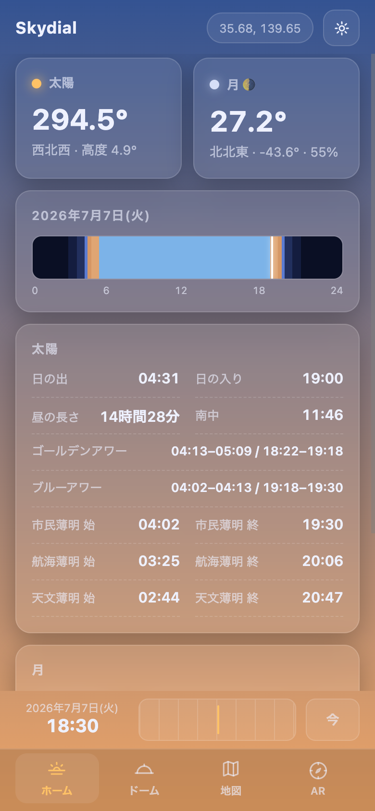
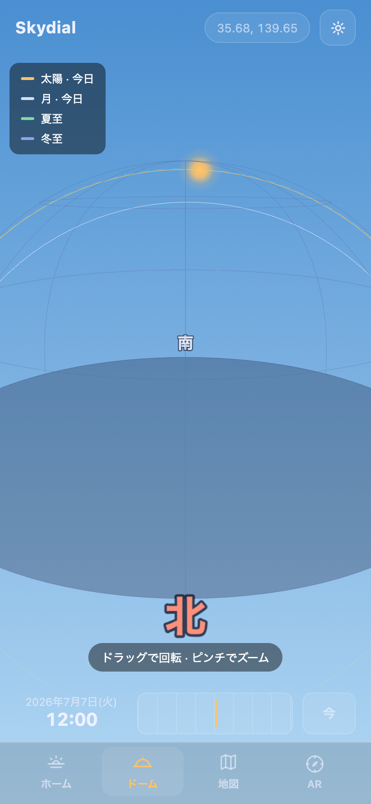
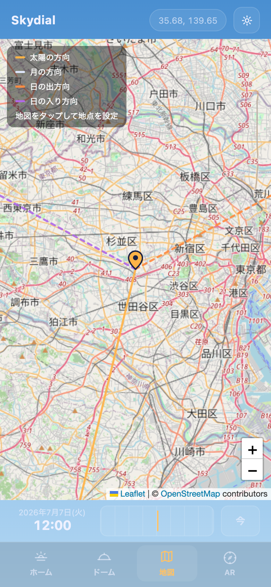
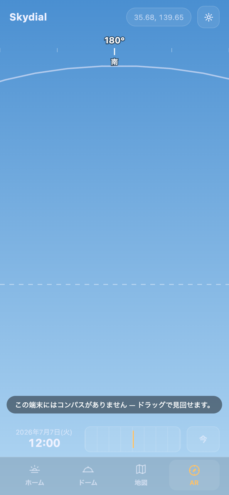

# Skydial — Sun & Moon Tracker

太陽と月の位置・日の出日没・薄明・ゴールデンアワー・月齢を、
**3Dドーム / 地図 / AR** で確認できるクロスプラットフォームPWA。
Sun Surveyor / Sun Seeker のような機能を、洗練されたモバイルファーストUIと ja/en 両対応で。

| ホーム | 3Dドーム | 地図 | AR |
|---|---|---|---|
|  |  |  |  |

## 機能

- **ダッシュボード**: 現在の太陽/月の方位・高度・月齢/輝面比、本日のタイムライン(薄明→日の出→ゴールデンアワー→…)、時刻一覧
- **3Dドーム**: 天球上の太陽軌跡(当日+夏至/冬至比較)と月軌跡
- **家の日射取得シミュレーション**(ドーム内): 自宅の寸法・屋根形状・窓・隣家をパラメトリックに入力し、
  影の落ち方と窓ごとの日射取得熱量(kWh)を3D表示。晴天モデル(Ineichen–Perez)で直達/散乱/反射を分離計算し、
  今日・夏至・冬至を比較。**室内への日射侵入も可視化**(屋根を半透明にしたドールハウス風カットアウェイで、
  窓ごとに色分けした日向パッチが床のどこまで届くかを3D表示。侵入距離・照射面積・室内日照時間も算出)。
  パッシブデザイン検討(南窓の冬の日射取得・夏の軒による日除け・隣家の影響)向け
- **地図**: 太陽/月の方位・日の出/日没方向を地図上に光線表示(撮影ロケハン向き)
- **AR**: カメラ映像+端末の向きセンサーで実風景に太陽/月の軌道を重畳
- **日時スクラバー**: 任意の日時にスクラブして過去未来の空を確認。URLで共有可能(家モデルも含む)
- 時刻連動の空グラデーション背景 / ダーク・ライトテーマ / 日本語・英語

## 技術構成

- Vanilla **Vite + TypeScript**(フレームワークなし)
- 天体計算は**依存ゼロの自前実装**(Meeus "Astronomical Algorithms" 準拠、NOAA/国立天文台こよみと突合テスト)
- Three.js(3Dドーム)/ Leaflet(地図)は**動的import** — 初期バンドルは数KB
- PWA: オフラインでも計算・ドーム・ARは全機能動作(地図タイルのみネット必須)
- 厳格CSP・Permissions-Policy(camera/geolocation=self)

## 開発

```bash
npm install
npm run dev        # 開発サーバー
npm test           # テスト
npm run coverage   # カバレッジ(純ロジック層100%ゲート)
npm run build      # tsc + vite build
```

## 品質指標(実測)

- **Lighthouse: mobile / desktop とも 100/100/100/100**(本番 https://skydial.vercel.app ・2026-07-08計測)
- **Mozilla Observatory: A+(120点・10/10)**
- 純ロジック層(astro/state/i18n/測地・投影・姿勢)カバレッジ **100% ゲート**(CI)
- npm audit 0件・gitleaks 0件

## 精度の裏付け

- 太陽位置は **JPL Horizons と ~0.002°で一致**、日の出入りは **USNO ±75秒**で突合
- 月の出入りは USNO ±4分、朔望(新月/満月)は USNO ±10分
- 磁気偏角は国土地理院 磁気図2020.0年値の近似式(日本域のみ・AR のAndroid磁北補正に使用)
- 日射取得は **Ineichen–Perez 晴天モデル**(pvlib-python 0.13.0 生成の参照値と0.1%以内で突合)+
  **Hay–Davies 傾斜面散乱**。遮蔽は建物・屋根・軒・隣家を三角形メッシュ化しMöller–Trumboreでレイトレース。
  気象データを使わない「快晴日」の概算(η・地面反射率は簡易固定)
- 室内の日向パッチは窓の4隅を太陽方向に沿って床へ投影し、建物footprint矩形でクリップする幾何計算
  (建物全体を1部屋として扱う簡略化。奥の壁に先に当たるような低い光線は「床に届かない」として扱う)

## 精度について

太陽位置 ~0.01°・月位置 ~0.3° の概算です。写真撮影・日照確認用途を想定しており、
航海・測量など高精度が必要な用途には使用しないでください。
